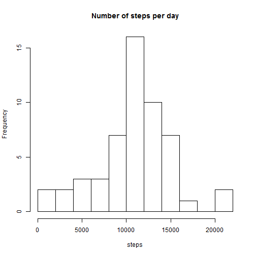
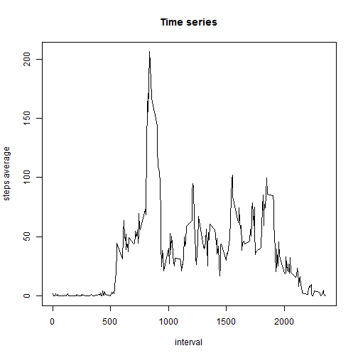
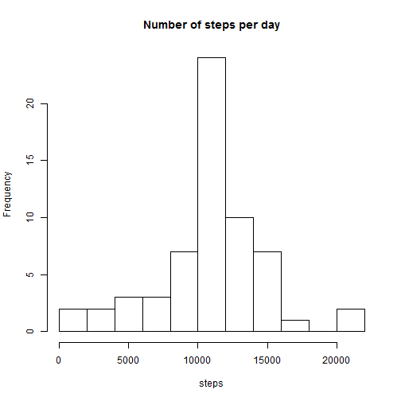
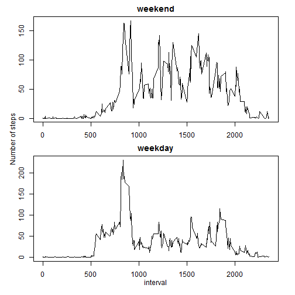

# Reproducible Research: Peer Assessment 1


## Loading and preprocessing the data

### Load the data (i.e. `read.csv()`)


```r
data = read.csv("../activity.csv")
```


### Process/transform the data (if necessary) into a format suitable for your analysis

There must be 17,568 observations in this dataset and three variables in each row.


```r
nrow(data)
```

```
## [1] 17568
```

```r
ncol(data)
```

```
## [1] 3
```


But there are some NA records:


```r
na.steps = sum(is.na(data$steps))
na.dates = sum(is.na(data$date))
na.intervals = sum(is.na(data$interval))
```


* NA `step` records: 2304
* NA `date` records: 0
* NA `interval` records: 0

There are NA records just in the `steps` column. As steps are saved in a 5-minute interval, there must be 12 rows in a hour and 288 in a day. It seems that NA values correspond to 8 complete days. This can be checked as follows:


```r
tmp = data[is.na(data$steps), ]
table(tmp$date)
```

```
## 
## 2012-10-01 2012-10-02 2012-10-03 2012-10-04 2012-10-05 2012-10-06 
##        288          0          0          0          0          0 
## 2012-10-07 2012-10-08 2012-10-09 2012-10-10 2012-10-11 2012-10-12 
##          0        288          0          0          0          0 
## 2012-10-13 2012-10-14 2012-10-15 2012-10-16 2012-10-17 2012-10-18 
##          0          0          0          0          0          0 
## 2012-10-19 2012-10-20 2012-10-21 2012-10-22 2012-10-23 2012-10-24 
##          0          0          0          0          0          0 
## 2012-10-25 2012-10-26 2012-10-27 2012-10-28 2012-10-29 2012-10-30 
##          0          0          0          0          0          0 
## 2012-10-31 2012-11-01 2012-11-02 2012-11-03 2012-11-04 2012-11-05 
##          0        288          0          0        288          0 
## 2012-11-06 2012-11-07 2012-11-08 2012-11-09 2012-11-10 2012-11-11 
##          0          0          0        288        288          0 
## 2012-11-12 2012-11-13 2012-11-14 2012-11-15 2012-11-16 2012-11-17 
##          0          0        288          0          0          0 
## 2012-11-18 2012-11-19 2012-11-20 2012-11-21 2012-11-22 2012-11-23 
##          0          0          0          0          0          0 
## 2012-11-24 2012-11-25 2012-11-26 2012-11-27 2012-11-28 2012-11-29 
##          0          0          0          0          0          0 
## 2012-11-30 
##        288
```


Dates have not the right class, but we keep the column as a factor because, in principle, it is going to be used as a group factor.


```r
str(data)
```

```
## 'data.frame':	17568 obs. of  3 variables:
##  $ steps   : int  NA NA NA NA NA NA NA NA NA NA ...
##  $ date    : Factor w/ 61 levels "2012-10-01","2012-10-02",..: 1 1 1 1 1 1 1 1 1 1 ...
##  $ interval: int  0 5 10 15 20 25 30 35 40 45 ...
```


As NA values can change the results we get, it is better off to create a new dataset from the raw one with the complete cases. A resizing of the factor variable called `date` is required:


```r
complete_cases = data[complete.cases(data), ]
complete_cases$date = factor(complete_cases$date)
```


## What is mean total number of steps taken per day?

### Make a histogram of the total number of steps taken each day


```r
steps.per.day = tapply(complete_cases$steps, complete_cases$date, sum)
hist(steps.per.day, breaks = 10, main = "Number of steps per day", xlab = "steps")
```

 


### Calculate and report the mean and median total number of steps taken per day


```r
mean = mean(steps.per.day)
median = median(steps.per.day)
```


The mean is 1.0766 &times; 10<sup>4</sup>.
The median is 10765.


## What is the average daily activity pattern?


```r
data_per_interval = tapply(complete_cases$steps, complete_cases$interval, mean)
times = complete_cases[1:288, "interval"]
```


### Make a time series plot (i.e. `type = "l"`) of the 5-minute interval (x-axis) and the average number of steps taken, averaged across all days (y-axis)


```r
plot(times, data_per_interval, type = "l", main = "Time series", xlab = "interval", 
    ylab = "steps average")
```

 


### Which 5-minute interval, on average across all the days in the dataset, contains the maximum number of steps?


```r
index = which.max(data_per_interval)
```


The interval with the maximum number of steps is: 835 


## Imputing missing values

### Calculate and report the total number of missing values in the dataset (i.e. the total number of rows with NAs)

This was calculated at the first section: 2304


### Devise a strategy for filling in all of the missing values in the dataset. The strategy does not need to be sophisticated. For example, you could use the mean/median for that day, or the mean for that 5-minute interval, etc.

The strategy used is to assign the mean for each 5-minute interval. There are eight days with missing values, and for each one we use the previously calculated set of averaged step values. The code is in the following section.


### Create a new dataset that is equal to the original dataset but with the missing data filled in.


```r
data.filledin = data
sum(is.na(data.filledin$steps))  # Now there must be some na values in steps column
```

```
## [1] 2304
```

```r
data.filledin[is.na(data.filledin$steps), "steps"] = rep(data_per_interval, 
    8)
sum(is.na(data.filledin$steps))  # Now there must be 0 na values in steps column
```

```
## [1] 0
```


### Make a histogram of the total number of steps taken each day and Calculate and report the mean and median total number of steps taken per day. Do these values differ from the estimates from the first part of the assignment? What is the impact of imputing missing data on the estimates of the total daily number of steps?


```r
steps.per.day = tapply(data.filledin$steps, data.filledin$date, sum)
hist(steps.per.day, breaks = 10, main = "Number of steps per day", xlab = "steps")
```

 

```r
mean_filledin = mean(steps.per.day)
median_filledin = median(steps.per.day)
```


The mean is 1.0766 &times; 10<sup>4</sup>.
The median is 1.0766 &times; 10<sup>4</sup>.

This new estimation are essentially the same. There is a slight increase in the median.


## Are there differences in activity patterns between weekdays and weekends?

Use the dataset with the filled-in missing values for this part.

### Create a new factor variable in the dataset with two levels - "weekday" and "weekend" indicating whether a given date is a weekday or weekend day.


```r
# We need to set the locale to get the same results everywhere
Sys.setlocale("LC_ALL", "English")
```

```
## [1] "LC_COLLATE=English_United States.1252;LC_CTYPE=English_United States.1252;LC_MONETARY=English_United States.1252;LC_NUMERIC=C;LC_TIME=English_United States.1252"
```

```r
data.filledin$daytype = with(data.filledin, ifelse(weekdays(strptime(date, "%Y-%m-%d")) %in% 
    c("Sunday", "Saturday"), "weekend", "weekday"))
data.filledin$daytype = factor(data.filledin$daytype)
```


To check that there are more weekday records than weekend records:


```r
table(data.filledin$daytype)
```

```
## 
## weekday weekend 
##   12960    4608
```


### Make a panel plot containing a time series plot (i.e. type = "l") of the 5-minute interval (x-axis) and the average number of steps taken, averaged across all weekday days or weekend days (y-axis). The plot should look something like the following, which was creating using simulated data:


```r
# Creating the datasets
weekdays = data.filledin[data.filledin$daytype == "weekday", ]
weekdays$daytype = factor(weekdays$daytype)
weekends = data.filledin[data.filledin$daytype == "weekend", ]
weekends$daytype = factor(weekends$daytype)

# Time axis data is common for both plots It was calculated above times =
# complete_cases[1:288,'interval']

# Calculating the aggregated for each interval
weekdays_ts = tapply(weekdays$steps, weekdays$interval, mean)
weekends_ts = tapply(weekends$steps, weekends$interval, mean)

# And the plots
par(mfrow = c(2, 1), mar = c(2, 2, 2, 2), oma = c(2, 2, 0, 0))

## Top
plot(times, weekends_ts, main = "weekend", ylab = "", xlab = "", type = "l")

## Bottom
plot(times, weekdays_ts, main = "weekday", ylab = "", xlab = "", type = "l")

mtext("Number of steps", outer = TRUE, side = 2)
mtext("interval", outer = TRUE, side = 1)
```

 


